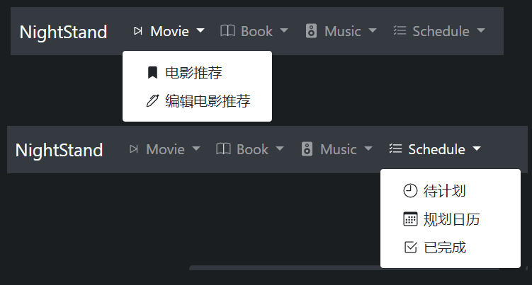

# NightStand - 基于 SpringBoot 和 Vue 的书影音管理系统

## 简单介绍

这个项目主要有两个部分：

* 书影音推荐列表的展示和编辑：借用了豆瓣的搜索api，完成条目的搜索功能，可以进行推荐列表的提交和上传。
* 书影音条目的完成计划：分成了`Waiting`, `Scheduled`, `Finished`三个部分将条目分类成为待完成、计划中、已完成三部分，其中计划中部分为按照日历浏览，方便用户的计划管理。

后端技术栈：

- SpringBoot + Mybatis
- SpringSecurity
- MySQL
- SpringCache + Caffeine
- Redis
- RabbitMQ

前端技术栈：

* Vue
* Bootstrap-Vue
* axios
* Vuex

## 效果图：





## 部署

1. clone 项目到本地
2. 数据库脚本使用 Flyway 管理，**不需要手动导入数据库脚本**，只需要提前在本地 MySQL 中创建一个空的数据库 `nightstand`(utf8md4)，并修改项目application.yml中的数据库连接池地址即可
3. 准备好 Redis，在 项目的 application.yml 文件中，将 Redis 配置改为自己的redis。
4. 提前准备好 RabbitMQ，在项目的 application.yml 文件中将 RabbitMQ 的配置改为自己的（**注意，RabbitMQ 需要同时修改 mailserver 和 nightstand 的配置文件**）

---

运行有两种方式：

1. SpringBoot直接运行**mailserver**和**nightstand**两个项目，使用static中的前端文件。这种启动方式可以完成Nightstand的所有功能，但是在点击条目的预览时会由于跨域访问被禁止而无法正常显示从豆瓣api查询的条目信息和图片。

2. 使用Vue-cli，进入vnightstand目录，输入以下命令（前提是先安装好note.js和vue，网络有教程）

   ```bash
   npm install
   npm run serve
   ```

   这时运行后端的springboot工程(**mailserver**和**nightstand**两个项目)，然后进入 localhost:8080 便可以通过vue的代理访问后端和豆瓣，解决跨域问题。

